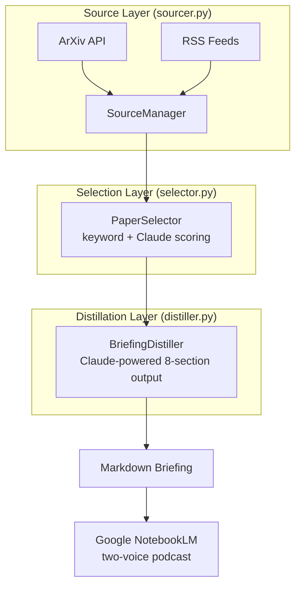

# CLAUDE.md

This file provides guidance to Claude Code (claude.ai/code) when working with code in this repository.

## Development Principles

### Shift-Left Testing
Every new component must include a test plan. Tests are written alongside code, not as an afterthought.
- **Python** (`tests/`) — pytest suites for sourcing, selection, distillation, pipeline, config

### Simplicity First
Make every change as simple as possible. Avoid massive or complex changes. Every change should impact as little code as necessary. When in doubt, prefer the simpler solution.

### Session Documentation
Document work in `docs/sessions/YYYYMMDD_*.md`. See `config/project.yaml` for phase tracking.

### Documentation Style
When creating diagrams in markdown documentation, **prefer Mermaid over ASCII art**. Mermaid renders natively in GitHub and provides clear, maintainable visualizations.

## Environment Setup

This project uses a Python virtual environment. **All commands must run inside the venv.**

```bash
# First-time setup
python3 -m venv .venv
source .venv/bin/activate
pip install -r requirements.txt
cp .env.example .env               # Add your ANTHROPIC_API_KEY
```

**Always use the venv's Python/pytest**:
```bash
source .venv/bin/activate           # Activate before working
# OR use the venv directly:
.venv/bin/pytest                    # Run tests without activating
.venv/bin/python main.py run        # Run pipeline without activating
```

## Quick Commands

```bash
# Run tests (venv must be active, or use .venv/bin/pytest)
pytest                             # All tests
pytest -k test_sourcer             # Tests matching pattern
pytest -k "selector and keyword"   # Multiple keywords
pytest -x                          # Stop on first failure
pytest --pdb                       # Debug on failure

# CLI
python main.py --help              # Show all commands
python main.py run                 # Run full pipeline (today's date)
python main.py run --date 2026-03-10  # Run for specific date
python main.py source              # Source papers only
python main.py select              # Score and select only
python main.py distill             # Distill briefing only
```

## Project Overview

Paperboy is an AI research podcast pipeline. It sources academic papers from ArXiv and blog articles from RSS feeds, scores them for relevance using hybrid keyword + Claude semantic scoring, distills the best into structured markdown briefings optimized for Google NotebookLM's two-voice podcast generation.

The target user is a research scientist who wants daily AI briefings tailored to their work, consumed during exercise or commute via podcast.

### About the Name

The name "Paperboy" is a lighthearted nod to the 1985 arcade game — the image of riding an exercise bike while getting ArXiv papers delivered. But the arcade and fitness angles are flavor, not focus. This repo's primary mission is **daily academic paper curation and delivery**. The delivery mechanism happens to be TTS consumed during a workout, which makes the name fun, but code, features, and documentation should stay grounded in the research pipeline domain. Don't theme things around arcades, bikes, or fitness.

## Tech Stack

- **Language**: Python (3.10+)
- **Dependencies**: arxiv, feedparser, anthropic, click, pyyaml, python-slugify, python-dotenv, python-dateutil

## Architecture



**Key principle**: The pipeline is modular. Each stage (source, select, distill) can run independently and produces a well-defined output that feeds the next stage.

## Project Structure

```
paperboy/
├── main.py                    # CLI entry point (click)
├── src/
│   ├── __init__.py
│   ├── config.py              # YAML config loader + validation
│   ├── models.py              # Paper, Article, ScoredPaper, BriefingDocument
│   ├── sourcer.py             # ContentSourcer ABC, ArxivSourcer, BlogSourcer, SourceManager
│   ├── selector.py            # PaperSelector (keyword + Claude scoring)
│   ├── distiller.py           # BriefingDistiller (Claude-powered, 8-section output)
│   ├── pipeline.py            # DailyPipeline orchestrator, PipelineResult
│   └── tts_interface.py       # TTSProvider ABC, stubs for future TTS
├── config/
│   ├── paperboy.yaml          # ArXiv categories, blogs, keywords, Claude settings
│   └── project.yaml           # Project identity, version, phases
├── tests/                     # pytest suites
│   └── test_pipeline.py       # Integration tests
├── docs/
│   ├── design/
│   │   ├── pillars.md         # 5 design pillars
│   │   └── roadmap.md         # Project roadmap
│   ├── sessions/              # Session documentation
│   └── plans/                 # Implementation plans
├── output/                    # Generated briefings (gitignored)
├── requirements.txt
├── .env.example
└── CLAUDE.md
```

## Current Phase

**Phase 2 — Configuration & Polish**: Agent/command alignment, error handling, CLI refinements. Phase 1 (core pipeline: Source, Select, Distill, Save) is complete and working end-to-end.

See `config/project.yaml` for all 6 build phases with status tracking.

## Config Workflow

YAML files in `config/` are the source of truth. Python reads YAML directly — no JSON sync step needed.

- `config/project.yaml` — Project identity, phases, paths
- `config/paperboy.yaml` — ArXiv categories, blog feeds, focus keywords, Claude API settings, selector weights, distiller preferences

API keys live in `.env` (never committed). See `.env.example` for required variables.

## Agents and Teams

**IMPORTANT**: Before deploying any agent team or multi-agent plan, read `.claude/agents/README.md` for the current roster and usage guide. Match agents to the work — don't invent ad-hoc roles when a prepositioned agent already covers the need.

### Agent Roster

Defined in `.claude/agents/`. See `.claude/agents/README.md` for detailed usage guidance.

| Agent | Model | Writes Code? | Primary Domain |
|---|---|---|---|
| `test-runner` | haiku | No | All — runs pytest, reports results |
| `code-reviewer` | inherit | No | All — reviews against pillars |
| `python-prototyper` | sonnet | Yes | Pipeline implementation |
| `content-curator` | sonnet | Yes | Sources, selection, scoring |
| `distiller-dev` | sonnet | Yes | Briefing quality, prompts |
| `pipeline-sme` | inherit | No | Mission alignment, roadmap, pillars |

All have persistent memory in `.claude/agent-memory/`. Manage with `/agents`.

### Team Templates

Defined in `.claude/teams/`. Choose the template that matches the work domain:

| Template | Domain | Agents |
|---|---|---|
| `source-development.md` | ArXiv/RSS sourcing | content-curator + test-runner + code-reviewer |
| `pipeline-feature.md` | Pipeline features | python-prototyper + test-runner + code-reviewer |
| `briefing-quality.md` | Distillation & output | distiller-dev + test-runner + pipeline-sme |

**File ownership is critical**: structure tasks so each teammate owns distinct files. See the team template for recommended ownership splits.

**Key commands for team leads**:
- `Shift+Up/Down` — Navigate between teammates
- `Shift+Tab` — Toggle delegate mode (coordination-only)
- `Ctrl+T` — Toggle shared task list
