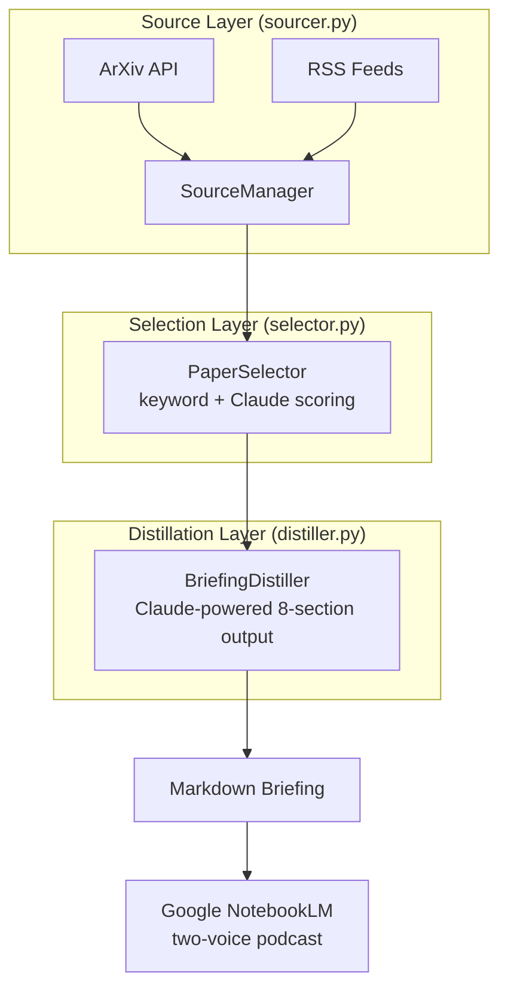

# CLAUDE.md

This file provides guidance to Claude Code (claude.ai/code) when working with code in this repository.

## Development Principles

### Shift-Left Testing (test-first, vertical-slice)
Every new behavior in `src/` is driven by a **failing test written first**, followed by the **minimum implementation** that makes it pass, then the next slice. This is vertical-slice (tracer-bullet) TDD; see [`.claude/skills/shift-left-testing/VERTICAL-SLICING.md`](.claude/skills/shift-left-testing/VERTICAL-SLICING.md).

Do not write a horizontal slice (all tests first, then all impl). Do not write production code without a failing test driving it.

A `PostToolUse` audit hook (`.claude/hooks/post-tool-shift-left-audit.sh`) fires after every `Write`/`Edit` to `src/**/*.py` and logs evidence to `.claude/audits/shift-left-violations.log`. The hook does not block; it produces an audit trail. See [`.claude/skills/shift-left-testing/ENFORCEMENT.md`](.claude/skills/shift-left-testing/ENFORCEMENT.md) for the full enforcement gradient.

- **Python** (`tests/`) — pytest suites for sourcing, selection, distillation, pipeline, config

### Simplicity First
Make every change as simple as possible. Avoid massive or complex changes. Every change should impact as little code as necessary. When in doubt, prefer the simpler solution. Prefer deep modules (small interfaces hiding meaningful implementation) over shallow ones; before declaring an interface done, ask whether each parameter is load-bearing or whether the function could derive it from one it already has.

### Branching (short-lived topic branches by work shape)
Branch on the shape of the work, not on a permanent partition of the codebase. Lead-only doc/ADR/small-refactor work lands directly on `main`. Team-deployed or multi-agent code work with an audit gate uses a short-lived `topic/<scope>-<slug>` branch, merged via merge-commit at the gate and **deleted (local + origin) immediately after merge**. No permanent domain branches. See [`.claude/skills/using-topic-branches/SKILL.md`](.claude/skills/using-topic-branches/SKILL.md), which also covers auditing standing branches.

### Session Documentation
Document work in `docs/sessions/YYYYMMDD_*.md`. See `config/project.yaml` for phase tracking.

### Documentation Style
When creating diagrams in markdown documentation, **prefer Mermaid over ASCII art**. Mermaid renders natively in GitHub and provides clear, maintainable visualizations.

## Prose Style

All prose artifacts follow the writing-simple-and-direct skill. The kernel:

1. Have a point; state it in the first sentence. No throat-clearing.
2. Prefer the concrete word: name the file, the number, the failure.
3. One idea per sentence. Link sentences; do not pack them.
4. Active voice unless the actor is unknown or irrelevant.
5. Cut cruft words. The banned list lives in LANGUAGE.md.
6. Hedge with numbers or not at all.
7. Read it back; if you would not say it, do not write it.
8. No em dashes in running prose. Choose the mark that states the relationship.

Schemas define what a document contains; this defines how the words go.
Never cut a required section to save tokens.

## Environment Setup

This project uses a Python virtual environment. **All commands must run inside the venv.**

```bash
# First-time setup
python3 -m venv .venv
source .venv/bin/activate
pip install -r requirements.txt
cp .env.example .env               # Add your ANTHROPIC_API_KEY
```

**Always use the venv's Python/pytest**:
```bash
source .venv/bin/activate           # Activate before working
# OR use the venv directly:
.venv/bin/pytest                    # Run tests without activating
.venv/bin/python main.py run        # Run pipeline without activating
```

## Quick Commands

```bash
# Run tests (venv must be active, or use .venv/bin/pytest)
pytest                             # All tests
pytest -k test_sourcer             # Tests matching pattern
pytest -k "selector and keyword"   # Multiple keywords
pytest -x                          # Stop on first failure
pytest --pdb                       # Debug on failure

# CLI
python main.py --help              # Show all commands
python main.py run                 # Run full pipeline (today's date)
python main.py run --date 2026-03-10  # Run for specific date
python main.py source              # Source papers only
python main.py select              # Score and select only
python main.py distill             # Distill briefing only

# Task Management (slash commands)
/task                              # List active tasks
/task add <description>            # Add a new task (default P2)
/task done <task>                  # Mark task complete
/task block <task> — <reason>      # Mark task blocked
/task promote <task>               # Escalate to TCS/CONOP/OPORD
/task brief                        # Generate session backbrief
/task plan <task>                  # Get planning recommendation
```

## Project Overview

Paperboy is an AI research podcast pipeline. It sources academic papers from ArXiv and blog articles from RSS feeds, scores them for relevance using hybrid keyword + Claude semantic scoring, distills the best into structured markdown briefings optimized for Google NotebookLM's two-voice podcast generation.

The target user is a research scientist who wants daily AI briefings tailored to their work, consumed during exercise or commute via podcast.

### About the Name

The name "Paperboy" is a lighthearted nod to the 1985 arcade game: the image of riding an exercise bike while getting ArXiv papers delivered. But the arcade and fitness angles are flavor, not focus. This repo's primary mission is **daily academic paper curation and delivery**. The delivery mechanism happens to be TTS consumed during a workout, which makes the name fun, but code, features, and documentation should stay grounded in the research pipeline domain. Don't theme things around arcades, bikes, or fitness.

## Tech Stack

- **Language**: Python (3.11+)
- **Dependencies**: arxiv, feedparser, anthropic, click, pyyaml, python-slugify, python-dotenv, python-dateutil

## Architecture



**Key principle**: The pipeline is modular. Each stage (source, select, distill) can run independently and produces a well-defined output that feeds the next stage.

## Workflow Commands

The project uses military-inspired slash commands for structured development workflow:

| Command | Purpose | When to Use |
|---------|---------|-------------|
| `/session-start` | Load context, check health, review tasks | Start of every session |
| `/session-end` | Commit, update tasks, write session doc | End of every session |
| `/task` | Manage task list, escalate work items | Track and plan work |
| `/pcc` | Pre-Code Check — fast pass/fail checklist | Before every push |
| `/pci` | Pre-Code Inspection — context-aware review | Before merge/PR or when PCC passes but confidence is low |
| `/sitrep` | Status report — narrative outbrief with concrete details | Team updates, progress summaries, scope-filtered status |
| `/implement-source` | Guided workflow for adding a new content source | Adding ArXiv categories, RSS feeds, API sources |

### Planning Escalation

Work scales through four levels. Use `/task promote` or `/task plan` to evaluate:

1. **Task** — One person, one session, clear action (`docs/tasks.md`)
2. **TCS** — Multi-step with pass/fail criteria (Task, Condition, Standard); also the universal task detail unit within all plan types
3. **CONOP** — Multi-wave with design decisions and parallel tracks (`docs/plans/`)
4. **OPORD** — Sequential execution of a decided strategy in waves (`docs/plans/`)

**Terminology**: *Phases* are strategic roadmap milestones (`project.yaml`). *Waves* are tactical parallel execution units within CONOPs/OPORDs where agent teams deploy.

## Project Structure

```
paperboy/
├── main.py                    # CLI entry point (click)
├── src/
│   ├── __init__.py
│   ├── config.py              # YAML config loader + validation
│   ├── models.py              # Paper, Article, ScoredPaper, BriefingDocument
│   ├── sourcer.py             # ContentSourcer ABC, ArxivSourcer, BlogSourcer, SourceManager
│   ├── selector.py            # PaperSelector (keyword + Claude scoring)
│   ├── distiller.py           # BriefingDistiller (Claude-powered, 8-section output)
│   ├── pipeline.py            # DailyPipeline orchestrator, PipelineResult
│   └── tts_interface.py       # TTSProvider ABC, stubs for future TTS
├── config/
│   ├── paperboy.yaml          # ArXiv categories, blogs, keywords, Claude settings
│   └── project.yaml           # Project identity, version, phases
├── tests/                     # pytest suites
│   └── test_pipeline.py       # Integration tests
├── docs/
│   ├── design/
│   │   ├── pillars.md         # 5 design pillars
│   │   └── roadmap.md         # Project roadmap
│   ├── sessions/              # Session documentation
│   └── plans/                 # Implementation plans
├── output/                    # Generated briefings (gitignored)
├── requirements.txt
├── .env.example
└── CLAUDE.md
```

## Current Phase

**Phase 2 — Configuration & Polish**: Agent/command alignment, error handling, CLI refinements. Phase 1 (core pipeline: Source, Select, Distill, Save) is complete and working end-to-end.

See `config/project.yaml` for all 6 build phases with status tracking.

## Config Workflow

YAML files in `config/` are the source of truth. Python reads YAML directly; no JSON sync step is needed.

- `config/project.yaml` — Project identity, phases, paths
- `config/paperboy.yaml` — ArXiv categories, blog feeds, focus keywords, Claude API settings, selector weights, distiller preferences

API keys live in `.env` (never committed). See `.env.example` for required variables.

## Agents and Teams

**IMPORTANT**: Before deploying any agent team or multi-agent plan, read `.claude/README.md` for the current roster and usage guide. Match agents to the work; don't invent ad-hoc roles when a prepositioned agent already covers the need.

### Agent Roster

Defined in `.claude/agents/`. See `.claude/README.md` for detailed usage guidance.

| Agent | Model | Writes Code? | Primary Domain |
|---|---|---|---|
| `pipeline-sme` | inherit | No | Mission alignment, roadmap, pillars |
| `proposer` | sonnet | No | Solution space exploration, pre-implementation proposals and debate |
| `content-curator` | sonnet | Yes | Sources, selection, scoring |
| `distiller-dev` | sonnet | Yes | Briefing quality, prompts |
| `test-runner` | haiku | No | All — runs pytest, reports results |
| `python-prototyper` | sonnet | Yes | Pipeline implementation |
| `code-reviewer` | inherit | No | All — reviews against pillars |
| `decision-scientist` | inherit | No | Weights, scoring fairness, bias, stats |

All have persistent memory in `.claude/agent-memory/`. Manage with `/agents`.

### Team Templates

Defined in `.claude/teams/`. Choose the template that matches the work domain:

| Template | Domain | Agents |
|---|---|---|
| `source-development.md` | ArXiv/RSS sourcing | proposer + content-curator + test-runner + code-reviewer |
| `feature-development.md` | Pipeline features | proposer + python-prototyper + test-runner + code-reviewer |
| `briefing-quality.md` | Distillation & output | proposer + distiller-dev + test-runner + pipeline-sme |
| `bug-fix.md` | Regression-first bug fixes | python-prototyper + test-runner |
| `code-review.md` | Quality audits (no code changes) | code-reviewer + test-runner |

**File ownership is critical**: structure tasks so each teammate owns distinct files. See the team template for recommended ownership splits.

**Key commands for team leads**:
- `Shift+Up/Down` — Navigate between teammates
- `Shift+Tab` — Toggle delegate mode (coordination-only)
- `Ctrl+T` — Toggle shared task list
