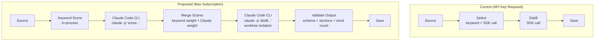

# CONOP: Claude Code Agent as Pipeline Engine

**Date**: 2026-03-10
**Status**: DRAFT — Awaiting review
**Type**: Concept of Operations — Agent-Powered Pipeline Stages
**Tags**: #pipeline #config #cli #conop #plan

**References**:
- [pillars.md](../design/pillars.md)
- [roadmap.md](../design/roadmap.md)
- [agent-eval](https://github.com/jhutchison/agent-eval) — Orchestrator pattern, worktree isolation, agent evaluation framework

---

## 1. Mission

Replace the `anthropic` Python SDK calls in paperboy's Claude-dependent pipeline stages (semantic scoring and briefing distillation) with **Claude Code CLI invocations** powered by the user's existing Max subscription. This eliminates the API key dependency while preserving pipeline functionality.

The agent operates on a **constrained git worktree** with defined inputs, outputs, time limits, and file system boundaries. The pipeline orchestrates the agent — the agent does not orchestrate itself.

---

## 2. Problem Statement

Paperboy's pipeline has two stages that require Claude:

| Stage | Current Implementation | What It Does |
|-------|----------------------|--------------|
| Semantic scoring (`selector.py`) | `anthropic.Anthropic().messages.create()` | Scores papers 0.0–1.0 for relevance to user's research interests |
| Briefing distillation (`distiller.py`) | `anthropic.Anthropic().messages.create()` | Generates 8-section markdown briefing from top-scoring paper |

Both require an **Anthropic API key** (`ANTHROPIC_API_KEY`), which the user does not currently have (console email delivery issues). The user does have a **Max20 subscription** that powers Claude Code CLI.

**The insight**: Claude Code CLI accepts prompts via `claude -p "prompt"` and returns structured text. The pipeline can invoke Claude Code as a subprocess instead of calling the HTTP API directly. Same model, different access path.

**Prior art**: The agent-eval project's `orchestrator.py` demonstrates this exact pattern — spawning coding agents as subprocesses with worktree isolation, environment variable stripping, instruction prepending, and timeout enforcement.

---

## 3. Design Philosophy

### 3.1 The Agent Is a Tool, Not an Operator

The pipeline is the operator. The agent is a tool — like `grep` or `curl`. The pipeline:
1. Prepares inputs (paper data, scoring criteria, output format)
2. Invokes the agent with a specific prompt
3. Validates the agent's output against a schema
4. Integrates valid output into the pipeline flow

The agent never decides *what* to do. It decides *how* to do the specific thing it was asked.

### 3.2 Worktree Isolation

The agent operates in a **temporary git worktree** branched from main. This provides:
- **File system boundary**: Agent can only see/modify files in the worktree
- **Rollback**: If the agent produces garbage, delete the worktree. Main is untouched.
- **Audit trail**: Agent's work is captured in git history on the worktree branch
- **No cross-contamination**: Agent cannot see or modify the pipeline's runtime state

### 3.3 Alignment with Design Pillars

| Pillar | How This Design Honors It |
|--------|--------------------------|
| **Content Quality First** | Same Claude model generates briefings — output quality is unchanged |
| **Source Diversity & Resilience** | If the agent fails, pipeline degrades gracefully (keyword-only scoring, no briefing) |
| **Hybrid Scoring** | Keyword scoring remains in-process. Only Claude scoring is delegated to agent |
| **Pipeline Idempotency** | Same inputs + same prompt + temperature=0 → deterministic output. Agent invocations are logged. |
| **Extensibility** | The agent interface is a clean abstraction — swap Claude Code for any CLI agent later |

---

## 4. Task-Condition-Standard

### Task 1: Semantic Paper Scoring

**Task**: Given a paper (title, abstract, authors, categories) and a list of research focus areas, return a relevance score (0.0–1.0) with reasoning.

**Conditions**:
- Agent receives a single prompt via `claude -p` containing the paper data and scoring rubric
- Agent has no file system access (prompt-only, no worktree needed for this task)
- Timeout: 30 seconds per paper, 5 papers max per invocation (batch prompt)
- Agent output must be valid JSON matching the scoring schema

**Standard**:
- Score is a float in [0.0, 1.0]
- Reasoning is a string explaining the score (1-3 sentences)
- Output is parseable JSON — no markdown fencing, no preamble
- Pipeline validates schema before accepting. Malformed output → fallback to keyword-only score.

**Input format**:
```
Score this paper's relevance to the research interests below.
Return ONLY a JSON object, no other text.

Paper:
  Title: {title}
  Abstract: {abstract}
  Categories: {categories}

Research interests:
  Primary: {primary_areas}
  Keywords: {keywords}

Output format:
  {"score": 0.0-1.0, "reasoning": "brief explanation"}
```

**Output validation**:
```python
def validate_score(output: str) -> Optional[dict]:
    try:
        data = json.loads(output.strip())
        assert 0.0 <= data["score"] <= 1.0
        assert isinstance(data["reasoning"], str)
        return data
    except (json.JSONDecodeError, KeyError, AssertionError):
        return None  # fallback to keyword-only
```

---

### Task 2: Briefing Distillation

**Task**: Given a paper (title, abstract, full text if available) and user context, generate an 8-section markdown briefing optimized for NotebookLM's two-voice podcast.

**Conditions**:
- Agent receives prompt via `claude -p` with paper data, style guide, and section structure
- Agent operates in a **temporary worktree** for this task (briefing generation may benefit from file I/O)
- Timeout: 120 seconds
- Agent output must be valid markdown with all 8 required sections
- Max output: 6000 words (hard limit enforced by pipeline)

**Standard**:
- All 8 sections present (validated by heading detection)
- Word count between 3000–6000 words
- No hallucinated citations or fabricated paper details
- Conversational tone (3Blue1Brown style, per distiller config)
- Challenger sections present (counterarguments, limitations)
- Output saved to worktree, pipeline reads and validates before copying to output/

**8 Required Sections** (from current `distiller.py`):
1. Hook — attention-grabbing opening
2. Context — why this paper matters now
3. Core Contribution — what the paper actually does
4. How It Works — technical explanation made accessible
5. Key Results — what they found
6. Challenger — counterarguments, limitations, what could go wrong
7. So What — implications for the listener's work
8. One Thing to Remember — single takeaway

**Output validation**:
```python
REQUIRED_SECTIONS = [
    "Hook", "Context", "Core Contribution", "How It Works",
    "Key Results", "Challenger", "So What", "One Thing to Remember"
]

def validate_briefing(content: str) -> list[str]:
    errors = []
    for section in REQUIRED_SECTIONS:
        if section.lower() not in content.lower():
            errors.append(f"Missing section: {section}")
    word_count = len(content.split())
    if word_count < 3000:
        errors.append(f"Too short: {word_count} words (min 3000)")
    if word_count > 6000:
        errors.append(f"Too long: {word_count} words (max 6000)")
    return errors
```

---

## 5. Constraints and Protections

### 5.1 File System Boundaries

| Constraint | Enforcement |
|-----------|-------------|
| Agent cannot access files outside worktree | Worktree is a separate directory; agent's cwd is set to worktree root |
| Agent cannot access `.env` or credentials | `.env` is gitignored — not present in worktree. No environment variables passed except PATH. |
| Agent cannot access `~/.claude/` config | Environment stripped of CLAUDE* vars (per agent-eval pattern) |
| Agent cannot install packages | No `pip install` in prompt instructions; worktree has no venv |
| Agent cannot access network (except Claude) | Not enforceable via CLI alone — mitigated by prompt constraints and output validation |

### 5.2 Git Protections

| Constraint | Enforcement |
|-----------|-------------|
| Agent cannot modify main branch | Worktree is on a temporary branch (e.g., `agent/score-20260310-143022`) |
| Agent cannot push to remote | No git remote configured in worktree; push URL not set |
| Agent cannot force-push or reset | Not in the agent's prompt; validated by post-run branch inspection |
| Worktree is disposable | Pipeline creates before invocation, deletes after extracting output |
| Agent's commits are not merged to main | Pipeline extracts files, not commits. Worktree branch is deleted. |

### 5.3 Process Boundaries

| Constraint | Enforcement |
|-----------|-------------|
| Timeout per invocation | `subprocess.run(..., timeout=N)` with SIGTERM → SIGKILL escalation |
| Max retries | Pipeline retries once on timeout/malformed output, then falls back |
| No interactive mode | `claude -p "prompt"` is non-interactive; stdin is /dev/null |
| Output size limit | Pipeline truncates stdout at 50KB before parsing |
| Process isolation | `subprocess.run` with stripped environment, explicit cwd |

### 5.4 Prompt Guardrails

| Constraint | Enforcement |
|-----------|-------------|
| Agent does only what's asked | Prompt is specific: "Score this paper" or "Generate this briefing." No open-ended instructions. |
| Agent returns structured output | Prompt specifies exact output format. Validation rejects non-conforming output. |
| Agent does not self-modify | No instructions to edit code, modify config, or update the repo |
| Agent does not access external URLs | Not in prompt; output validation flags URLs not in the original paper data |

---

## 6. Architecture

### 6.1 Pipeline Flow (Current vs. Proposed)



### 6.2 Component Design

**New module**: `src/agent_runner.py`

```python
class AgentRunner:
    """Invokes Claude Code CLI as a subprocess for pipeline tasks."""

    def __init__(self, config: PipelineConfig):
        self.timeout_score = 30      # seconds per scoring batch
        self.timeout_distill = 120   # seconds for briefing generation
        self.max_retries = 1

    def score_paper(self, paper: Paper, focus_areas: FocusAreas) -> Optional[dict]:
        """Score a paper via Claude Code CLI. Returns {"score": float, "reasoning": str}."""

    def distill_paper(self, paper: Paper, config: DistillerConfig) -> Optional[str]:
        """Generate briefing via Claude Code CLI in worktree. Returns markdown string."""

    def _invoke(self, prompt: str, timeout: int) -> Optional[str]:
        """Low-level: subprocess.run(['claude', '-p', prompt], ...) with guardrails."""

    def _create_worktree(self) -> Path:
        """Create temporary git worktree for agent isolation."""

    def _cleanup_worktree(self, path: Path):
        """Delete worktree and temporary branch."""
```

**Modified modules**:
- `selector.py` — Replace `Anthropic().messages.create()` with `AgentRunner.score_paper()`
- `distiller.py` — Replace `Anthropic().messages.create()` with `AgentRunner.distill_paper()`
- `pipeline.py` — Initialize `AgentRunner` instead of `Anthropic` client when no API key is available

### 6.3 Fallback Chain

```
API key available?
  ├── YES → Use anthropic SDK directly (current behavior, fastest)
  └── NO → Claude Code CLI available?
        ├── YES → Use AgentRunner (this CONOP)
        └── NO → Keyword-only scoring, no distillation
                  (graceful degradation per Pillar 2)
```

The SDK path remains the primary. The agent path is a fallback for users without API keys. Both produce the same output format — the pipeline doesn't know or care which backend generated the scores.

---

## 7. Implementation Plan

### Phase 1: AgentRunner Core

- [ ] Create `src/agent_runner.py` with `_invoke()` method
- [ ] Implement subprocess invocation with timeout, env stripping, stdin=/dev/null
- [ ] Implement output truncation and basic validation
- [ ] Unit test: mock subprocess, verify timeout enforcement
- [ ] Unit test: verify environment is stripped of sensitive vars
- [ ] Unit test: verify malformed output returns None

### Phase 2: Scoring Integration

- [ ] Implement `AgentRunner.score_paper()` with prompt template
- [ ] Implement JSON output validation
- [ ] Modify `selector.py` to accept `AgentRunner` as alternative to `Anthropic` client
- [ ] Unit test: scoring prompt produces valid JSON (mocked)
- [ ] Integration test: keyword + agent scoring merge produces valid `ScoredPaper`

### Phase 3: Distillation Integration

- [ ] Implement `AgentRunner.distill_paper()` with prompt template
- [ ] Implement worktree creation/cleanup
- [ ] Implement briefing validation (8 sections, word count)
- [ ] Modify `distiller.py` to accept `AgentRunner` as alternative
- [ ] Unit test: briefing validation catches missing sections
- [ ] Integration test: agent-generated briefing passes all validators

### Phase 4: Pipeline Integration

- [ ] Modify `pipeline.py` to detect available backends (SDK vs. CLI vs. keyword-only)
- [ ] Implement fallback chain
- [ ] Add `--backend` CLI flag: `api`, `agent`, `keyword-only`, `auto` (default)
- [ ] End-to-end test: `python main.py run --backend agent` produces a briefing
- [ ] Update `config/paperboy.yaml` with agent runner settings (timeouts, retries)

### Phase 5: Hardening

- [ ] Stress test: agent timeout → graceful fallback (no hang, no zombie process)
- [ ] Stress test: malformed agent output → retry once → fallback
- [ ] Stress test: worktree cleanup on pipeline crash (atexit handler)
- [ ] Document: `CLAUDE.md` updated with agent backend section
- [ ] Document: session doc

---

## 8. Risks and Mitigations

| Risk | Impact | Likelihood | Mitigation |
|------|--------|-----------|------------|
| `claude` CLI not on PATH | Agent invocation fails silently | Medium | Check at pipeline startup, clear error message |
| Agent hallucinates paper details | Briefing contains fabricated claims | Low | Validation cross-references paper data; flag unknown URLs/citations |
| Agent ignores output format | Unparseable response | Medium | Strict JSON/section validation + retry + fallback |
| Agent takes too long | Pipeline hangs | Medium | Hard timeout with SIGTERM/SIGKILL escalation |
| Worktree not cleaned up | Disk space leak | Low | atexit handler + startup cleanup of stale `agent/*` branches |
| Agent reads paperboy source code and modifies behavior | Unpredictable output | Very Low | Worktree contains only paper data file, not full repo. Prompt is self-contained. |
| Max subscription rate limits | Scoring fails mid-batch | Medium | Respect rate limits; batch papers (5 per prompt); retry with backoff |
| Claude Code CLI interface changes | Subprocess invocation breaks | Low | Pin to `claude -p` interface; version check at startup |
| Agent produces different output than SDK | Pipeline behavior changes | Medium | Validate output schema is identical; A/B test when API key becomes available |

---

## 9. Open Questions

These must be resolved before implementation begins. Each question includes the initial recommendation and the user's initial response. These positions are starting points — we expect to learn and adjust as implementation proceeds.

### Q1: Prompt-only vs. worktree for scoring

**Recommendation**: Prompt-only for scoring, worktree only for distillation. Scoring is stateless and produces ~50 bytes of JSON — no file system access needed.

**Initial Response**: Agreed. Prompt-only for scoring, worktree for distillation. The separation maps cleanly to the complexity of each task.

### Q2: Output format testing

**Recommendation**: Test whether `claude -p` supports output format hints (e.g., `--output-format json`). If not, the prompt must enforce structured output via instruction alone.

**Initial Response**: Our agent team should absolutely test input and output formats as part of shift-left testing. This is a Phase 1 deliverable — we validate the CLI interface contract before building on top of it.

### Q3: Batching strategy

**Recommendation**: Start with 1 paper per invocation, optimize to batch later if latency is a problem.

**Initial Response**: Agreed on starting with 1, but the target is 5 papers per batch and we should build toward it quickly. Critically, batch size must be a **configurable value in `config/`** — not a hardcoded constant. `config/paperboy.yaml` is the single source of truth for all pipeline parameters, and batch size is no exception.

### Q4: Temperature control

**Recommendation**: Test whether `claude -p` accepts temperature settings. Idempotency (Pillar 4) requires temperature=0 for deterministic scoring.

**Initial Response**: Agreed. Shift testing left — verify CLI capabilities early so we know what we're building on.

### Q5: Max subscription usage limits

**Recommendation**: Check Anthropic's Max plan documentation for per-day or per-hour invocation limits.

**Initial Response**: Max usage limits are per-session, not per-day or per-hour, and are less cleanly defined than API rate limits. We won't hit them with this framework's current scope, but we should not be wasteful. A deep research dive into Anthropic's Max plan documentation is warranted before we start burning invocations in loops. Respect the resource.

### Q6: Dual-backend testing

**Recommendation**: Support both backends (`--backend api` vs `--backend agent`) for A/B comparison when the API key becomes available, then converge on one.

**Initial Response**: Wholeheartedly agreed. The dual-backend approach validates that the agent path produces equivalent output to the SDK path. This is how we build confidence in the agent backend before making it primary.

---

## 10. Success Criteria

### Minimum Viable
- `python main.py run --backend agent` produces a valid briefing from today's papers
- No API key required — runs on Max subscription via Claude Code CLI
- Scoring output matches SDK output schema (same `ScoredPaper` objects)
- Briefing output passes all 8-section validation checks
- Graceful fallback on agent failure (keyword-only scoring, error message for distillation)
- All existing tests pass (no regressions)

### Full Success
- All of the above, plus:
- Fallback chain works (`auto` mode detects available backends)
- Worktree isolation verified (agent cannot access main branch files)
- Environment stripping verified (no sensitive vars leaked to agent)
- Timeout enforcement verified (agent killed cleanly on timeout)
- Pipeline runs end-to-end in under 5 minutes for a single paper

### Stretch Goals
- A/B comparison between SDK and agent backends (when API key available)
- Batch scoring (5 papers per invocation)
- Agent process metrics logged (invocation time, retry count, output size)
- Pattern documented for reuse in other projects

---

## 11. Relationship to Existing Work

### agent-eval Orchestrator Pattern

The agent-eval project's `orchestrator.py` solves the same problem in a different domain:

| Concern | agent-eval Solution | paperboy Adaptation |
|---------|-------------------|-------------------|
| Agent isolation | Git worktree per eval run | Git worktree for distillation |
| Environment stripping | Strip `CLAUDECODE*` vars | Strip `CLAUDECODE*` + `ANTHROPIC_API_KEY` vars |
| Timeout | `subprocess.Popen` + `taskkill` (Windows) | `subprocess.run(..., timeout=N)` (Linux) |
| Instruction prepend | Venv path + "don't read eval tests" | Output format spec + paper data |
| Output capture | stdout + diff analysis | stdout → JSON parse or markdown validation |
| Cleanup | `--no-cleanup` flag for debugging | Always cleanup unless `--keep-worktree` flag |

The paperboy agent runner is simpler than agent-eval's orchestrator because:
1. The agent is not writing code — it's generating text (scoring JSON, briefing markdown)
2. There is no multi-turn interaction — single prompt, single response
3. There is no evaluation framework — just input validation and output validation

### Kahneman System 1 / System 2 Connection

From the agent-eval study: agents given System 1 (fast/intuitive) profiles tended to anchor on initial approaches, while System 2 (slow/deliberative) profiles showed more pivot behavior. For paperboy:

- **Scoring** is a System 1 task — quick relevance judgment, pattern matching
- **Distillation** is a System 2 task — structured reasoning, section organization, tone calibration

The prompt design should reflect this: scoring prompts should be terse and direct; distillation prompts should include the full rubric, examples, and style guide.

---

## 12. Notes for Future Sessions

- This CONOP is a **Phase 2 enhancement** (Configuration & Polish). It does not block Phase 1 functionality — the pipeline works end-to-end with mock data and keyword-only scoring today.

- If the API key becomes available before this is implemented, the CONOP is still valuable — it provides a second backend that works without API credits, useful for development, testing, and users who only have Max subscriptions.

- The agent runner abstraction (`AgentRunner`) should be designed as a **provider interface** (Pillar 5 — Extensibility). Future providers could include: Bedrock, Vertex, local LLMs (ollama), or other CLI agents (Aider, OpenCode). The interface is: `prompt in → structured text out`.
