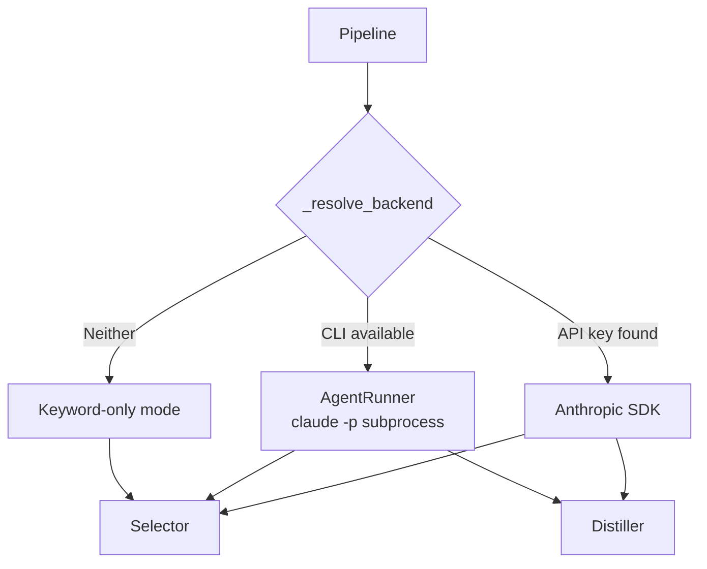

# Session: Implement Claude Code CLI as Pipeline Backend (AgentRunner)

**Date**: 2026-03-10
**Branch**: main
**Tags**: #session #pipeline #select #distill #config #cli #complete #pillar-5

**Documents**: [pillars.md](../design/pillars.md) — Extensibility by Design (Pillar 5)
**Implements**: [20260310_agent_pipeline_conop.md](../plans/20260310_agent_pipeline_conop.md) — Agent Pipeline CONOP
**Follows**: [20260310_identity_and_api_exploration.md](20260310_identity_and_api_exploration.md)
**Completes**: Phase 2 milestone — Dual-backend architecture

---

## Summary

Implemented `AgentRunner`, a subprocess wrapper that invokes `claude -p` (Claude Code CLI) as an alternative backend for Claude-dependent pipeline stages. This enables users with a Claude Max subscription to run the full pipeline without an Anthropic API key.

## Architecture

**Fallback chain** (auto mode): API key → Claude CLI → keyword-only

## Key Changes

| File | Change |
|------|--------|
| `src/agent_runner.py` | **NEW** — 402 lines. Subprocess invocation with env isolation, timeout enforcement, output truncation, preamble stripping, structured validation |
| `src/pipeline.py` | Added `_resolve_backend()`, `--backend` param, dual-client wiring |
| `src/selector.py` | Dual SDK/CLI paths in `_score_with_claude()`, fixed stale-score bug |
| `src/distiller.py` | Dual SDK/CLI paths in `_generate_briefing()` |
| `src/config.py` | Added `AgentRunnerConfig` dataclass with 6 tuning knobs |
| `main.py` | `--backend` CLI flag, non-fatal API key warning handling |
| `config/default_config.yaml` | `agent_runner:` section |
| `tests/test_agent_runner.py` | **NEW** — 48 tests covering all AgentRunner methods |
| `tests/test_pipeline_backend.py` | **NEW** — 10 tests for backend resolution |

## AgentRunner Design Decisions

1. **Agent is a tool, not an operator** — Pipeline calls `claude -p` with specific prompts and validates output; Claude doesn't make pipeline decisions
2. **Environment isolation** — `ANTHROPIC_API_KEY` and `CLAUDE*` env vars stripped to force CLI to use Max subscription
3. **Preamble stripping** — CLI outputs text before JSON/markdown; `_strip_preamble_json()` and `_strip_preamble_markdown()` handle this
4. **Graceful degradation** — AgentRunner scoring returns default 0.5 on failure instead of crashing; distillation raises on failure
5. **Same prompts** — Reuses existing `SYSTEM_PROMPT` and `build_user_prompt()` from distiller.py (CONOP condition C4)

## Pipeline-SME Conditions Met

- **C1**: CLI supports `--system-prompt` flag (discovered via spike)
- **C2**: Output normalized to existing contracts (`tuple[float, str]` for scoring, `str` for distillation)
- **C3**: No worktree — prompt-only invocation
- **C4**: Reuses existing prompt templates from distiller.py

## Test Results

62/62 tests passing (48 AgentRunner + 10 backend + 4 existing)

## Bugs Fixed

- **Stale-score bug** (selector.py): `scored_paper.score` overwritten before being read in reasoning string
- **Missing ImportError guard** (selector.py): Bare `from anthropic import Anthropic` would crash without SDK
- **Config flag ignored**: `agent_runner.enabled` wasn't checked in `_resolve_backend()`

## Next Steps

- End-to-end test with actual `claude` CLI on a machine with Max subscription
- Consider `--system-prompt` flag usage instead of prompt concatenation
- Distiller: return partial success instead of RuntimeError on AgentRunner failure
