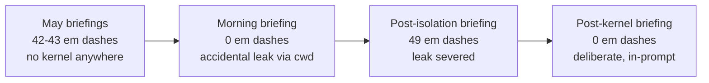

# Session: Public Release Preparation — Doctrine Cycle, Prose Sweep, Privacy Scrub, Pipeline Isolation

**Date**: 2026-07-20
**Branch**: main (one topic branch, `topic/docs-public-prose-sweep`, merged at `1d66fdd` and deleted per branching doctrine)
**Tags**: #session #doctrine #infra #config #docs #bugfix #complete #pillar-1 #pillar-2 #pillar-3 #pillar-4

**Documents**: [pillars.md](../design/pillars.md) — style sweep + episode-length correction | [roadmap.md](../design/roadmap.md) — feed roster updated
**References**: [.claude/upstream-update.md](../../.claude/upstream-update.md) — 2026-07-20 tacsop entry, annotated with disposal | [writing-simple-and-direct](../../.claude/skills/writing-simple-and-direct/SKILL.md) — the skill that shaped most of the day
**Follows**: [20260522_doctrine_adoption.md](20260522_doctrine_adoption.md)
**Cites**: [tacsop](https://github.com/jhutchison0/tacsop) — upstream hub, renamed from `utils` this cycle

---

## Summary

Prepared paperboy for public release in one session: adopted the 2026-07-20 upstream doctrine cycle (three parts), swept every major doc through the new `writing-simple-and-direct` skill behind a code-reviewer audit gate, privatized the distiller's personal `user_context` in both the working tree and git history (two full history rewrites, force-pushed), fixed the blog feed roster after a live audit, isolated the Agent backend from workspace context after briefing forensics exposed a prompt leak, relicensed GPL v3 to Apache-2.0, and then deliberately re-introduced the prose kernel into the distiller prompt with a controlled verification (same paper, em dashes 49 to 0). Thirteen commits; suite grew 156 to 166 tests, all passing.

## Work Completed

### 1. Upstream doctrine cycle 2026-07-20 (`4e6878d`)

Adopted all three parts of the tacsop entry surfaced at session start:

- **Part 1 (hub rename `utils` → `tacsop`)**: already done on this machine; verified directory, remote URL, and sync. Paperboy carries no `adopt_doctrine.py` copy, so nothing to patch.
- **Part 2 (planning doctrine)**: `CONOP-FORMAT.md` + `OPORD-FORMAT.md` copied into `docs/plans/`; `task.md` merged (promote wiring, proword naming scheme, Prowords section); deep-modules sentence appended to Simplicity First. `python-prototyper` Step 4d was already present verbatim.
- **Part 3 (writing & testing doctrine)**: `writing-simple-and-direct` skill copied and its ADOPTION.md run in full (CLAUDE.md Prose Style kernel, LANGUAGE.md Cruft Words section, code-reviewer checklist line); `shift-left-testing` upgraded 2.0.0 → 2.1.0 with four new sidecars, `SCRIPTS.md` adapted for the flat `src/` layout, local `ENFORCEMENT.md` customizations preserved with the style-sweep punctuation fixes hand-merged. Hypothesis plumbing deferred to the first property test. LICENSE was NO ACTION at adoption time (superseded later the same day; see §7).

The upstream entry is annotated with per-artifact disposal, following the house convention of annotating rather than deleting.

### 2. Public-repo prose sweep (`130d638`, `12faddb`, merged `1d66fdd`)

Swept README, CONTEXT, LANGUAGE, CLAUDE, CHANGELOG, `docs/adr/`, `docs/design/`, and `config/` on a short-lived topic branch. Rule 8 (no em dashes in running prose) drove most edits; list-index separators, headings, tables, quotes, and code kept their conventions. CHANGELOG and both config YAML comment sets needed zero edits. Records got a lighter touch: past CHANGELOG entries untouched; ADR-0001 received punctuation-only edits blessed through a dated Amendments section, mirroring the hub's treatment of its own ADR-0001.

Factual corrections rode along where docs contradicted code or config, with code as the authority:

- LANGUAGE.md's **Eight-Section Structure** entry listed section names that do not exist in `src/distiller.py`; corrected to the real headers.
- LANGUAGE.md's **BlogSourcer** feed list did not match `config/paperboy.yaml`; corrected.
- pillars.md claimed 4,500 words ≈ 15-minute episodes; live runs, README, and CHANGELOG all say ~20; aligned.
- CONTEXT.md snapshot refreshed (tacsop rename, test count, cycle history).

**Audit gate**: `code-reviewer` reviewed the branch per `REVIEWING.md` and returned APPROVE WITH FIXES, four Minor findings (three missed dashes, one double-colon line), all applied in `12faddb`. Merged with a merge commit; branch deleted local-side (never pushed).

### 3. Privacy: `user_context` privatization and two history rewrites

The distiller's `user_context` named the user's employer, role, and division in the tracked config. Decision: work email stays (it identifies the user at ANL and they are fine with that); role and division go private, in the working tree and in history.

**Code** (`5f08a35`): `USER_CONTEXT` in `.env` now overrides `distiller.user_context`, built test-first in three slices (override wins; blank env falls back, which drove a strip guard; absent env falls back). Tests are hermetic against a developer's real `.env`. The tracked YAML carries a generic persona; `.env.example` documents the override; the real context migrated to a newly created local `.env` (the Agent backend never needed one before) and was verified end-to-end.

**History**: two `git-filter-repo` rewrites, both verified against every blob in all commits, then force-pushed:

1. **Mailmap** (run by the user after a permission-classifier block): the typo author email `jhustchion@anl.gov` (one commit) mapped to `jhutchison@anl.gov`. Zero occurrences remain.
2. **Replace-text**: the four sensitive `user_context` lines replaced in every historical `config/paperboy.yaml` and `config/default_config.yaml` blob. History held exactly one wording variant, so four literal rules covered everything. Zero matches remain for the employer name or any of the role/division phrasing (the exact strings are deliberately not quoted here; the replacement rules lived only in session-local scratch).

Every commit hash changed. Living docs (tasks.md, upstream-update.md) were repointed to new hashes (`ad7ff8f`); session docs keep their original hashes as records. Old-to-new map for previously cited hashes: `c61b79d→c06e8ba`, `2bd8d62→1d66fdd`, `1e8620a→540fd32`, `358c521→3233311`, `4e44f25→da6bf50`, `a70e66d→2be3218`, `ca6cc0f→859f903`.

**Hygiene checks** (same pass): `.env` never committed; only placeholder keys in history; sessions clean of personal references; `.claude/settings.local.json` added to `.gitignore`.

### 4. Blog feed audit fix (`17bec23`)

A live warning ("Anthropic Research: text/html is not an XML media type") triggered the standing P3 audit. Findings and disposition, all verified by direct fetch and feedparser:

| Feed | Finding | Action |
|---|---|---|
| Anthropic Research | 404; no official feed at any conventional path | Commented out with re-enable note (community mirror noted as an opt-in) |
| Google Research | Feedburner feed carried 2024-era entries under a fresh feed-level timestamp | Replaced with `research.google/blog/rss/` (100 entries, current) |
| OpenAI | Config URL silently redirected | Updated to `openai.com/news/rss.xml` |
| Distill.pub | Archived since 2021 | Commented out with note |
| Lilian Weng, The Gradient | Healthy | Unchanged |

Verified live: `python main.py source` returned 82 papers + 10 articles with zero feed warnings. Feed-roster references aligned in README, LANGUAGE.md, roadmap.md, CONTEXT.md.

### 5. Agent backend isolation (`92d821e`)

Briefing forensics answered "would the new skill influence our briefings?": May briefings carried 42 and 43 em dashes; today's carried 0. Cause: `AgentRunner`'s `Popen(["claude", "-p", ...])` inherited the repo cwd, so the CLI loaded CLAUDE.md (now carrying the prose kernel) into every scoring and distillation prompt. Fix, test-first: `cwd=tempfile.gettempdir()`. Restores the distiller prompt as sole style authority (Pillar 1), removes a hidden output input (Pillar 4), and keeps workspace context out of relevance scoring (Pillar 3). Verified by a fresh full run: em dashes returned (49), proving isolation.

### 6. Relicense GPL v3 → Apache-2.0 (`7c15e32`)

Sole author, never distributed, so no copyleft obligations ever attached (the hub's own rationale). Apache-2.0 makes the repo uniform with tacsop template content that lands every doctrine cycle, fits the repo's role as a public personal tool, and adds the explicit patent grant. Canonical LICENSE text; README badge updated; the 2026-03-11 GPL switch stays in tasks.md as a record.

### 7. Prose kernel in the distiller prompt (`c539160`), verified (`328f29b`)

The deliberate counterpart to §5: the user wants briefings to follow the skill, so the briefing-adapted kernel now lives in `SYSTEM_PROMPT`, the only channel that reaches both backends identically. Eight prose rules (concrete words, one idea per sentence, active voice, the cruft-word ban, hedge-with-numbers, no em dashes, no throat-clearing, read-aloud test) with the section structure explicitly outranking them, per the skill's own schemas-outrank-style boundary. `_validate_briefing` logs an em-dash count warning so prompt drift is visible in run logs. New `tests/test_distiller.py` (6 tests) also gives `distiller.py` its audit-hook test partner.

**Controlled verification**: the same paper (arXiv:2607.16131) redistilled under the new prompt.

| Metric | Old prompt | New prompt |
|---|---|---|
| Em dashes | 49 | 0 |
| Cruft words | 1 | 0 |
| Sections | 8/8 | 8/8 |
| Words | 4,945 | 4,615 |

## Key Decisions

| Decision | Rationale |
|---|---|
| Apply the skill to briefings via the distiller prompt, not by letting `claude -p` see the workspace | Project discovery is all-or-nothing (whole CLAUDE.md, settings, all skills; contaminates scoring); the API backend can never load skills, so the prompt is the only channel that treats both backends identically |
| Records keep old hashes; living docs repointed | Session docs are records of what was true when written; tasks.md and upstream-update.md are operational pointers that must resolve |
| ADR punctuation edits allowed via Amendments section | Mirrors the hub's own append-only exception; decision content, status, dates, and the historical `utils` name untouched |
| Keep `jhutchison@anl.gov` in history; scrub only the typo and the role/division text | The email identifies the user by their own choice; the typo email breaks GitHub account linking; role/division exceed what the email already reveals |
| Comment out dead feeds rather than delete | Re-enabling is a two-line diff; the notes document why each is off |
| Apache-2.0 over copyleft | Copyleft protects against proprietary capture, not a concern for a personal tool published as an example; uniformity with hub content removes mixed-license bookkeeping |

## Pillar Compliance

| Pillar | Status | Notes |
|---|---|---|
| **Content Quality First** | PASS | Prose kernel is now a deliberate, versioned part of the distiller prompt; structure explicitly outranks style |
| **Source Diversity & Resilience** | PASS | Feed roster is live-verified again (10 articles); degradation behavior confirmed by the very warning that triggered the audit |
| **Relevance Through Hybrid Scoring** | PASS | Scoring prompts no longer carry leaked workspace context |
| **Pipeline Idempotency** | PASS | Workspace docs removed as hidden inputs; `USER_CONTEXT` is an explicit, documented env input |
| **Extensibility by Design** | UNCHANGED | No interface changes |

## Commits

| Hash | Subject |
|---|---|
| `4e6878d` | [doc][infra] Adopt upstream tacsop 2026-07-20 doctrine cycle |
| `130d638` | [doc] Public-repo prose sweep per writing-simple-and-direct |
| `12faddb` | [doc] Apply audit-gate fixes: 3 missed em dashes + double-colon line |
| `1d66fdd` | Merge topic/docs-public-prose-sweep: public-repo prose sweep |
| `85c529a` | [doc] Task list: record public-repo prose sweep completion |
| `30cc87c` | [doc] Task: privatize distiller user_context (P1, pre-public gate) |
| `5f08a35` | [config][test] Privatize distiller user_context via USER_CONTEXT env var |
| `ad7ff8f` | [doc] Close user_context P1 task; repoint hash refs after history rewrite |
| `17bec23` | [source][config] Blog feed audit: fix dead and stale feeds |
| `92d821e` | [fix][agent][test] Run claude -p in neutral cwd to isolate pipeline prompts |
| `7c15e32` | [infra] Relicense GPL v3 -> Apache-2.0 ahead of going public |
| `c539160` | [distill][test] Carry writing-simple-and-direct kernel in the distiller prompt |
| `328f29b` | [doc] Task list: record prose-kernel verification (49 -> 0 em dashes) |

Plus two out-of-band history rewrites (`git-filter-repo --mailmap`, `--replace-text`) and one force-push. Hashes above are post-rewrite and current.

## Next Steps

- [ ] **Listen-test the prose kernel** (new P3 task, owner distiller-dev): generate NotebookLM episodes from the kernel-styled ToolSciVer briefing and its pre-kernel baseline; text metrics are verified, host delivery is not.
- [ ] **Flip the repo public** (user action). Optional certainty step first: ask GitHub support to run GC so pre-rewrite objects cannot resolve by URL.
- [ ] Re-clone (or hard-reset) any other machine's clone of paperboy; pre-rewrite clones must not be pushed.
- [ ] Consider cutting v0.3.0 with a CHANGELOG entry at the moment of release; today's work is a natural release boundary.
- [ ] Standing P3s: temperature control on the CLI path, batch scoring (batch_size 1 → 5), CONOP checklist status.
- [ ] First property test (Hypothesis plumbing deferred from the doctrine cycle; selector scoring invariants are the candidate).
